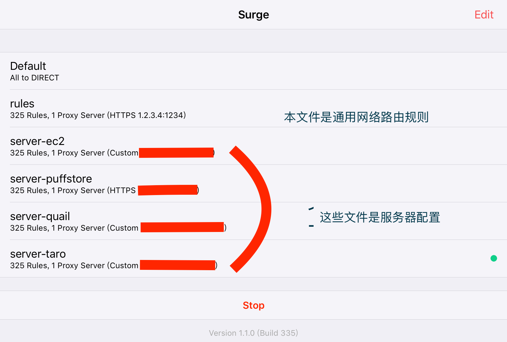

# Surge Configuration File 

Updated 2015/11/05 14:00 UTC+8

## **Download**

github: 
 
	https://github.com/crystoneme/surge.conf/

路由规则：rules.conf: 
	
	https://raw.githubusercontent.com/crystoneme/surge.conf/master/rules.conf

服务器配置：server.conf: 

	https://raw.githubusercontent.com/crystoneme/surge.conf/master/server.conf

路由规则（安全）rules-safe.conf: 
	
	https://raw.githubusercontent.com/crystoneme/surge.conf/master/rules-safe.conf

服务配置（安全）server-safe.conf: 

	https://raw.githubusercontent.com/crystoneme/surge.conf/master/server-safe.conf

## **Description**

 This rules conf file is tested for surge.app 1.1.0 Build 335 under iOS 9.0+

 The file rules.conf depend on file server.conf which defines your own proxy.

 It's for my own use purpose, maybe works not well in your network, so consider some modification work to suitable for your own situation. 

 **Add conf (rules-safe.conf and server-safe.conf) used for safe surfing consideration when you're connect to public wifi.**

 Created for myself ([@crystone](https://twitter.com/crystone)), based on other people's work, thanks for them:

* Gist from janlay: [https://gist.github.com/janlay/b57476c72a93b7e622a6](https://gist.github.com/janlay/b57476c72a93b7e622a6)

* Gist from soffchen: [https://gist.github.com/soffchen/47a44825626b1cbd0948](https://gist.github.com/soffchen/47a44825626b1cbd0948)

* Gist from scomper: [https://gist.github.com/scomper/b0c6129840272c136a82](https://gist.github.com/scomper/b0c6129840272c136a82)

* Gist from iyee: [https://gist.github.com/iyee/2e27c124af2f7a4f0d5a](https://gist.github.com/iyee/2e27c124af2f7a4f0d5a)

* Gist from kemychen: [https://gist.github.com/kemychen/8c2cf04bbb226470a008](https://gist.github.com/kemychen/8c2cf04bbb226470a008)

* Gist from Blankwonder: [https://gist.github.com/Blankwonder/feefe4e23865d1464d5f](https://gist.github.com/Blankwonder/feefe4e23865d1464d5f)

* Gist from jason5ng32: [https://gist.github.com/jason5ng32/648597df6ca7da5aeb41](https://gist.github.com/jason5ng32/648597df6ca7da5aeb41)

* Repo from hzlzh: [https://github.com/hzlzh/Surge.conf/blob/master/surge-HTTP-Proxy.conf](https://github.com/hzlzh/Surge.conf/blob/master/surge-HTTP-Proxy.conf)

* Gist from tufu9441: [https://gist.github.com/tufu9441/a0148457d0ccbd4469e7#file-surge-conf-L29](https://gist.github.com/tufu9441/a0148457d0ccbd4469e7#file-surge-conf-L29)

* Gist from laincat: [https://gist.github.com/laincat/27a9e040c216eda81575](https://gist.github.com/laincat/27a9e040c216eda81575)

* sofish: [http://proxy.sofi.sh/](http://proxy.sofi.sh/)

* Surge's site: [https://surge.run](https://surge.run/)

* Forum: [https://surge.tips](https://surge.tips/)

## **Usage**

本surge.conf包含rules.conf和server.conf

rules.conf为网络路由配置规则，不包含服务器信息

server.conf为服务器信息，路由规则调用的是rules.conf。一个配置文件包含一个服务器配置，这样设计可以多服务器切换，而不用改代理规则。

如下图所示：

